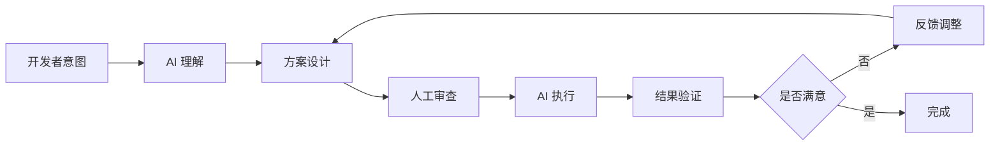

# 第1章：设计理念的起源

> "Design is not just what it looks like and feels like. Design is how it works." — Steve Jobs

Claude Code 的设计不是随意的决定，而是基于对 AI 能力的深刻理解和对开发流程的细致观察。本章将探讨 Claude Code 的核心设计理念，以及这些理念如何塑造了整个系统。

## 1.1 AI First - 从第一性原理出发

### 为什么选择 AI Native 的设计？

传统的开发工具以人为主导，AI 只是附属功能。Claude Code 颠覆了这个模式，从第一天起就将 AI 作为核心设计考量。

**AI First 意味着**：

1. **AI 是主要驱动力**：工具的所有功能都围绕 AI 的能力与限制展开设计。

2. **上下文为王**：AI 的能力很大程度上取决于上下文的质量，因此上下文管理成为核心功能。

3. **渐进式的自主性**：从完全人工控制，到半自主，再到高度自主，AI 的自主性根据场景渐进。

### 人机协作的理想模式

Claude Code 的设计哲学不是"AI 替代人类"，而是"AI 增强人类"。



这种协作模式的关键在于：

- **意图理解**：AI 不仅要理解"做什么"，还要理解"为什么"。
- **方案设计**：AI 提出多个方案，解释各自的权衡。
- **人工审查**：开发者保持最终决策权。
- **执行反馈**：AI 执行并报告结果，开发者验证。

### Trust but Verify 的权限哲学

AI 执行操作的能力带来巨大的风险。Claude Code 采用"Trust but Verify"的权限哲学：

```typescript
// 权限模式定义
type PermissionMode =
  | 'default'      // 默认：危险操作需要确认
  | 'plan'         // 规划模式：只读操作
  | 'auto'         // 自动模式：减少确认
  | 'bypass'       // 绕过模式：无需确认（危险！）
```

**设计考量**：

1. **默认安全**：默认情况下，所有可能有害的操作都需要用户确认。

2. **渐进信任**：随着使用时间的增加，用户可以逐步放权。

3. **审计透明**：所有操作都有日志，可追溯、可审查。

4. **沙箱隔离**：高风险操作在隔离环境中执行。

## 1.2 模块化与可扩展性

### 工具系统的设计思想

Claude Code 的核心是工具系统（Tool System）。每个工具都是自包含的模块：

```typescript
export type Tool<T extends ZodType<any, any, any> = ZodType<any, any, any>> = {
  name: string              // 工具名称
  description: string       // 工具描述
  inputSchema: T           // 输入参数 Schema (Zod)
  permissionMode?: PermissionMode  // 权限模式
  progressMessage?: string  // 进度消息
  run: (input: z.infer<T>, context: ToolUseContext) => Promise<ToolResult>
}
```

这种设计带来几个好处：

1. **独立开发**：每个工具可以独立开发、测试、部署。

2. **组合使用**：工具之间可以组合，形成复杂的工作流。

3. **权限隔离**：每个工具可以有自己的权限配置。

4. **扩展友好**：添加新工具无需修改核心代码。

### 插件架构的考量

Claude Code 支持插件机制，允许第三方扩展功能：

```
plugins/
├── built-in/        # 内置插件
└── third-party/     # 第三方插件
```

插件可以：

- 注册新的工具
- 注册新的命令
- 提供 MCP Server
- Hook 到特定的事件

### 死代码消除与性能优化

Claude Code 使用 Bun 的特性标志（Feature Flags）实现死代码消除：

```typescript
import { feature } from 'bun:bundle'

// 条件编译：如果不支持语音模式，这段代码根本不会打包进去
const voiceCommand = feature('VOICE_MODE')
  ? require('./commands/voice/index.js').default
  : null
```

这种设计使得：

1. **按需加载**：只加载用户需要的功能。
2. **减少包体积**：未使用的代码在编译时完全移除。
3. **灵活配置**：通过特性标志控制功能的开关。

## 1.3 上下文管理哲学

### 上下文是 AI 的短期记忆

对 AI 来说，上下文窗口是有限的资源。如何高效利用这个资源，是设计的核心问题。

**Claude Code 的策略**：

1. **分层上下文**：
   ```typescript
   // System Context: 会话级别的缓存上下文
   const systemContext = {
     gitStatus,     // Git 状态
     projectInfo,   // 项目信息
     memoryPrompt,  // Memory 提示
   }

   // User Context: 每轮对话的用户上下文
   const userContext = {
     currentFile,   // 当前文件
     recentChanges, // 最近变更
     userRequest,   // 用户请求
   }
   ```

2. **优先级排序**：根据重要性对上下文排序，优先保留关键信息。

3. **动态调整**：根据任务类型动态调整上下文内容。

### 平衡信息量与 Token 成本

上下文越多，AI 理解越好，但成本也越高。Claude Code 在设计时权衡了这两者：

```typescript
// Git 状态限制
const MAX_STATUS_CHARS = 2000

const truncatedStatus =
  status.length > MAX_STATUS_CHARS
    ? status.substring(0, MAX_STATUS_CHARS) +
      '\n... (truncated because it exceeds 2k characters)'
    : status
```

**优化策略**：

- **智能截断**：不是简单截断，而是保留最重要的信息。
- **按需加载**：用户询问时再加载详细信息。
- **压缩算法**：使用 compact 算法压缩历史对话。

### 缓存策略与性能优化

Claude Code 大量使用缓存来提升性能：

```typescript
// 并行预取
async function startup() {
  // 并行执行，加速启动
  await Promise.all([
    startMdmRawRead(),        // MDM 设置读取
    startKeychainPrefetch(),  // Keychain 预取
    initGrowthBook(),         // 特性标志初始化
  ])

  // 然后才开始主流程
  startMainLoop()
}
```

**缓存层次**：

1. **会话缓存**：会话级别的 System Context 缓存。
2. **Prompt Cache**：Claude API 的 Prompt Cache（1小时有效期）。
3. **文件缓存**：读取过的文件内容缓存。

## 1.4 用户隐私与安全

### 权限系统的设计原则

Claude Code 的权限系统遵循以下原则：

1. **最小权限原则**：默认只授予必要的权限。

2. **知情同意**：任何敏感操作都需要用户明确同意。

3. **透明审计**：所有操作都有日志，用户可以审查。

4. **易于撤销**：用户可以随时撤销已授予的权限。

### 数据隔离与沙箱机制

为了保护用户数据，Claude Code 实现了多层次的隔离：

```typescript
// 文件系统隔离
const allowedPaths = [
  getCwd(),                    // 当前工作目录
  getMemoryDir(),              // Memory 目录
  getScratchpadDir(),          // 临时目录
]

function isPathAllowed(path: string): boolean {
  const absolute = resolve(path)
  return allowedPaths.some(allowed =>
    absolute.startsWith(allowed)
  )
}
```

### 审计与透明性

所有工具调用都被记录：

```typescript
interface ToolCallLog {
  toolName: string
  input: unknown
  output: unknown
  timestamp: Date
  permission: 'granted' | 'denied' | 'auto'
  userConfirmation?: boolean
}
```

用户可以随时查看这些日志，了解 AI 执行了哪些操作。

## 总结

Claude Code 的设计理念可以总结为：

1. **AI First**：从 AI 的能力与限制出发设计系统。
2. **Trust but Verify**：默认安全，渐进信任。
3. **模块化**：工具系统、插件架构、特性标志。
4. **上下文管理**：平衡信息量与成本，智能缓存。
5. **隐私安全**：权限控制、数据隔离、审计透明。

这些理念贯穿了整个系统的设计，后续章节将深入探讨这些理念在具体模块中的实现。

---

<div style="text-align: center; margin-top: 2rem;">
  <a href="/preface" style="margin-right: 1rem;">← 序言</a>
  <a href="/chapter-02-architecture-overview">第二章：系统架构概览 →</a>
</div>
