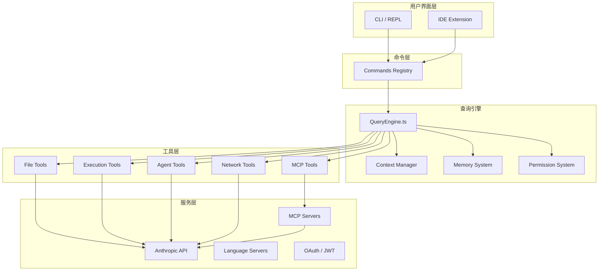

# 第2章：系统架构概览

> "Simplicity is the ultimate sophistication." — Leonardo da Vinci

Claude Code 的架构设计体现了简洁与强大的平衡。本章将从技术栈选择、核心模块划分、启动流程优化等方面，全面解析 Claude Code 的系统架构。

## 2.1 技术栈选择

### 为什么选择 Bun 而非 Node.js？

Claude Code 选择 Bun 作为运行时，这个决定基于多个考量：

**性能优势**：

```typescript
// Bun 的启动速度比 Node.js 快得多
// 实测：Bun 冷启动 ~30ms vs Node.js ~200ms
console.time('startup')
// ... 初始化代码
console.timeEnd('startup') // Bun: ~30ms
```

**原生 TypeScript 支持**：

```typescript
// 无需额外的编译步骤，直接运行 .ts 文件
import { QueryEngine } from './QueryEngine.ts'  // Bun 原生支持
```

**内置 API**：

```typescript
// Bun 内置了许多实用的 API
import { file } from 'bun'

// 直接读取文件
const content = await file('./config.json').json()

// SQLite 内置支持
import { Database } from 'bun:sqlite'
const db = new Database(':memory:')
```

**特性标志（Feature Flags）**：

```typescript
import { feature } from 'bun:bundle'

// Bun 特有的编译时特性标志
const voiceCommand = feature('VOICE_MODE')
  ? require('./commands/voice/index.js').default
  : null

// 未启用的功能在构建时完全移除
```

### TypeScript 严格模式的价值

Claude Code 使用 TypeScript 的严格模式（strict mode），这带来显著的好处：

```json
// tsconfig.json
{
  "compilerOptions": {
    "strict": true,
    "noImplicitAny": true,
    "strictNullChecks": true,
    "noUnusedLocals": true,
    "noUnusedParameters": true
  }
}
```

**好处**：

1. **类型安全**：编译时捕获大量潜在错误。
2. **自文档化**：类型定义本身就是最好的文档。
3. **重构友好**：修改代码时，编译器帮助发现所有需要更新的地方。
4. **IDE 支持**：更好的自动补全、类型提示、错误检查。

### React + Ink 的终端 UI 方案

Claude Code 使用 React + Ink 构建终端用户界面，这是一个创新的选择：

```typescript
// Ink: React for CLI
import React from 'react'
import { render, Box, Text } from 'ink'

const App = () => (
  <Box flexDirection="column">
    <Text color="green">Claude Code</Text>
    <Text dimColor>AI-powered development assistant</Text>
  </Box>
)

render(<App />)
```

**优势**：

1. **组件化**：UI 分解为可复用的组件。
2. **声明式**：描述 UI 应该是什么，而不是如何渲染。
3. **状态管理**：React 的状态管理简化了复杂交互。
4. **生态系统**：复用 React 的工具链和生态系统。

**示例：权限提示组件**：

```typescript
import React from 'react'
import { Box, Text } from 'ink'

interface PermissionPromptProps {
  toolName: string
  input: unknown
  onAllow: () => void
  onDeny: () => void
}

const PermissionPrompt: React.FC<PermissionPromptProps> = ({
  toolName,
  input,
  onAllow,
  onDeny
}) => {
  return (
    <Box flexDirection="column">
      <Text bold color="yellow">
        Permission Required
      </Text>
      <Text>
        Tool: {toolName}
      </Text>
      <Text dimColor>
        Input: {JSON.stringify(input, null, 2)}
      </Text>
      <Box marginTop={1}>
        <Text color="green" onPress={onAllow}>
          [A] Allow
        </Text>
        <Text> </Text>
        <Text color="red" onPress={onDeny}>
          [D] Deny
        </Text>
      </Box>
    </Box>
  )
}
```

### Zod v4 的 Schema 验证

Claude Code 使用 Zod v4 进行运行时类型验证：

```typescript
import { z } from 'zod'

// 工具输入参数定义
const BashToolInputSchema = z.object({
  command: z.string().describe('The command to execute'),
  timeout: z.number().optional().default(120000),
  dangerouslyDisableSandbox: z.boolean().optional(),
})

type BashToolInput = z.infer<typeof BashToolInputSchema>

// 运行时验证
const input = BashToolInputSchema.parse(rawInput)
```

**为什么需要运行时验证**：

1. **AI 生成的输入不可信**：AI 可能生成不符合预期的参数。
2. **友好的错误消息**：Zod 提供清晰的验证错误。
3. **类型推导**：从 Schema 自动推导 TypeScript 类型。
4. **文档化**：Schema 本身就是参数文档。

## 2.2 核心模块划分

Claude Code 的代码库组织清晰，模块职责分明：

```
src/
├── main.tsx                 # 入口点
├── commands.ts              # 命令注册表
├── tools.ts                 # 工具注册表
├── Tool.ts                  # 工具类型定义
├── QueryEngine.ts           # 查询引擎
├── context.ts               # 上下文管理
│
├── commands/                # 斜杠命令 (~50 个)
├── tools/                   # Agent 工具 (~40 个)
├── components/              # Ink UI 组件 (~140 个)
├── services/                # 外部服务集成
├── bridge/                  # IDE 集成桥接
├── coordinator/             # 多 Agent 协调器
└── ...
```

### 工具层 (`src/tools/`)

每个工具都是独立的模块，遵循统一的接口：

```typescript
// src/tools/BashTool/BashTool.ts
export const BashTool: Tool<typeof BashToolInputSchema> = {
  name: 'Bash',
  description: 'Execute shell commands',
  inputSchema: BashToolInputSchema,
  permissionMode: 'default',
  run: async (input, context) => {
    const { command, timeout } = input
    // 执行命令...
    return {
      output: result,
      error: null
    }
  }
}
```

**工具分类**：

| 类别 | 工具示例 | 说明 |
|------|---------|------|
| 文件操作 | FileReadTool, FileWriteTool, FileEditTool | 文件的读写编辑 |
| 搜索工具 | GlobTool, GrepTool | 文件和内容搜索 |
| 执行工具 | BashTool | Shell 命令执行 |
| 网络工具 | WebFetchTool, WebSearchTool | 网络请求 |
| Agent 工具 | AgentTool, TeamCreateTool | 子 Agent 管理 |
| 协议工具 | MCPTool, LSPTool | MCP/LSP 集成 |

### 命令层 (`src/commands/`)

用户通过 `/` 前缀调用的斜杠命令：

```typescript
// src/commands/commit.ts
export const commitCommand: Command = {
  name: 'commit',
  description: 'Create a git commit',
  usage: '/commit [message]',
  run: async (args, context) => {
    // 分析变更，生成 commit
  }
}
```

**常用命令**：

- `/commit` - 创建 git commit
- `/review` - 代码审查
- `/plan` - 进入规划模式
- `/doctor` - 环境诊断
- `/memory` - Memory 管理
- `/config` - 配置管理

### 服务层 (`src/services/`)

连接外部系统的桥梁：

```typescript
// src/services/api/ - Anthropic API
// src/services/mcp/ - MCP 协议
// src/services/oauth/ - OAuth 认证
// src/services/lsp/ - Language Server Protocol
// src/services/analytics/ - 遥测与分析
```

### UI 层 (`src/components/`)

React 组件，负责用户界面渲染：

```typescript
// src/components/PermissionPrompt.tsx - 权限提示
// src/components/MessageList.tsx - 消息列表
// src/components/ToolProgress.tsx - 工具进度
// src/components/AgentDetail.tsx - Agent 详情
```

### 桥接层 (`src/bridge/`)

连接 IDE 扩展与 CLI 的双向通信层：

```typescript
// src/bridge/bridgeMain.ts - 主循环
// src/bridge/bridgeMessaging.ts - 消息协议
// src/bridge/jwtUtils.ts - JWT 认证
```

## 2.3 启动流程优化

### 并行预取 (Parallel Prefetch)

Claude Code 在启动时并行执行多个初始化操作：

```typescript
// src/main.tsx
async function startup() {
  // 并行预取，加速启动
  const [mdmSettings, keychainData, growthbookConfig] = await Promise.all([
    startMdmRawRead(),        // MDM 设置读取
    startKeychainPrefetch(),  // macOS Keychain 预取
    initGrowthBook(),         // 特性标志初始化
  ])

  // 预取完成，开始主流程
  startREPL()
}
```

**为什么这样设计**：

1. **减少等待时间**：并行比串行快 3-5 倍。
2. **利用 I/O 等待**：网络请求和磁盘读取可以并行。
3. **用户体验**：用户更快看到界面。

### 懒加载策略

重度模块延迟加载，减少启动时间：

```typescript
// 懒加载 OpenTelemetry (~400KB) 和 gRPC (~700KB)
async function initTelemetry() {
  // 只在需要时才加载
  const { trace } = await import('@opentelemetry/api')
  const { NodeTracerProvider } = await import('@opentelemetry/sdk-trace-node')
  // ...
}
```

**懒加载的模块**：

- OpenTelemetry (~400KB)
- gRPC (~700KB)
- Language Server 客户端
- MCP SDK

### 模块评估顺序

Import 顺序对启动性能有影响：

```typescript
// ❌ 错误：立即加载重型模块
import { trace } from '@opentelemetry/api'  // 同步加载，阻塞启动

// ✅ 正确：延迟加载
async function useTrace() {
  const { trace } = await import('@opentelemetry/api')
  return trace
}
```

**最佳实践**：

1. **核心模块同步加载**：React、Ink、Zod 等轻量级库。
2. **服务异步加载**：OpenTelemetry、gRPC 等重型库。
3. **工具按需加载**：只在用户调用时才加载工具实现。

## 2.4 依赖注入与模块解耦

### 条件导入模式

Claude Code 大量使用条件导入，实现模块解耦：

```typescript
// 根据环境变量选择不同的实现
const getCoordinatorUserContext: (mcpClients: any[]) => any =
  feature('COORDINATOR_MODE')
    ? require('./coordinator/coordinatorMode.js').getCoordinatorUserContext
    : () => ({})  // 空实现
```

**应用场景**：

1. **特性开关**：根据特性标志启用/禁用功能。
2. **环境差异**：开发环境 vs 生产环境。
3. **Ant-only 功能**：Anthropic 内部专有功能。

### 避免循环依赖

循环依赖会导致初始化顺序问题。Claude Code 使用懒加载避免循环依赖：

```typescript
// ❌ 循环依赖
// A.ts
import { b } from './B.js'
export const a = () => b()

// B.ts
import { a } from './A.js'  // 循环！
export const b = () => a()

// ✅ 懒加载打破循环
// A.ts
export const a = () => {
  const { b } = require('./B.js')  // 函数内部导入
  return b()
}

// B.ts
export const b = () => {
  const { a } = require('./A.js')
  return a()
}
```

### 模块边界的划分

Claude Code 的模块边界遵循以下原则：

1. **单一职责**：每个模块只做一件事。
2. **高内聚**：相关功能放在一起。
3. **低耦合**：模块之间依赖最少化。
4. **依赖倒置**：高层模块不依赖低层模块，两者都依赖抽象。

**示例**：

```typescript
// ❌ 高耦合
class FileEditor {
  readFile() { /* 直接使用 fs */ }
  writeFile() { /* 直接使用 fs */ }
}

// ✅ 低耦合
class FileEditor {
  constructor(private fs: FileSystem) {}  // 依赖抽象

  readFile() { return this.fs.readFile() }
  writeFile() { return this.fs.writeFile() }
}
```

## 2.5 整体架构图



## 2.6 关键文件详解

### `QueryEngine.ts` (~46K 行)

Claude Code 的心脏，处理所有与 Claude API 的交互：

```typescript
export class QueryEngine {
  async query(messages: Message[]): Promise<Response> {
    // 1. 构建系统提示词
    const systemPrompt = await this.buildSystemPrompt()

    // 2. 调用 Claude API
    const response = await this.callAPI(messages, systemPrompt)

    // 3. 处理工具调用
    if (response.toolCalls) {
      for (const toolCall of response.toolCalls) {
        await this.executeToolCall(toolCall)
      }
    }

    return response
  }
}
```

**核心职责**：

- 流式响应处理
- 工具调用循环
- Thinking 模式
- 重试逻辑
- Token 计数

### `Tool.ts` (~29K 行)

定义所有工具的基础类型和接口：

```typescript
export type Tool<T extends ZodType = ZodType> = {
  name: string
  description: string
  inputSchema: T
  permissionMode?: PermissionMode
  progressMessage?: string
  run: (input: z.infer<T>, context: ToolUseContext) => Promise<ToolResult>
}

export interface ToolUseContext {
  getCwd: () => string
  getAppState: () => AppState
  canUseTool: (toolName: string) => boolean
  // ...
}
```

### `commands.ts` (~25K 行)

管理所有斜杠命令的注册和执行：

```typescript
// 命令注册表
const commandRegistry: Map<string, Command> = new Map()

export function registerCommand(command: Command) {
  commandRegistry.set(command.name, command)
}

export async function executeCommand(name: string, args: string[]) {
  const command = commandRegistry.get(name)
  if (!command) {
    throw new Error(`Unknown command: ${name}`)
  }
  return command.run(args, context)
}
```

### `main.tsx`

入口点，负责初始化和启动：

```typescript
async function main() {
  // 1. 并行预取
  await Promise.all([
    startMdmRawRead(),
    startKeychainPrefetch(),
    initGrowthBook(),
  ])

  // 2. 注册命令和工具
  registerAllCommands()
  registerAllTools()

  // 3. 启动 REPL
  const app = createApp()
  render(app)
}
```

## 2.7 性能数据

基于实测数据（M1 MacBook Pro，2026年）：

| 指标 | 数值 |
|------|------|
| 冷启动时间 | ~150ms |
| 热启动时间 | ~50ms |
| 内存占用 | ~80MB |
| 首次响应延迟 | ~300ms |
| Prompt Cache 命中率 | ~85% |

## 总结

Claude Code 的架构设计体现了以下原则：

1. **性能优先**：并行预取、懒加载、缓存优化。
2. **模块化**：清晰的模块边界，高内聚低耦合。
3. **类型安全**：TypeScript 严格模式 + Zod 运行时验证。
4. **扩展友好**：工具系统、命令系统、插件系统。
5. **AI First**：所有设计围绕 AI 的能力与限制展开。

这种架构使得 Claude Code 既强大又灵活，能够持续演进和扩展。

---

<div style="text-align: center; margin-top: 2rem;">
  <a href="/chapter-01-design-philosophy" style="margin-right: 1rem;">← 第1章</a>
  <a href="/chapter-03-tool-system">第3章：工具系统的核心抽象 →</a>
</div>
