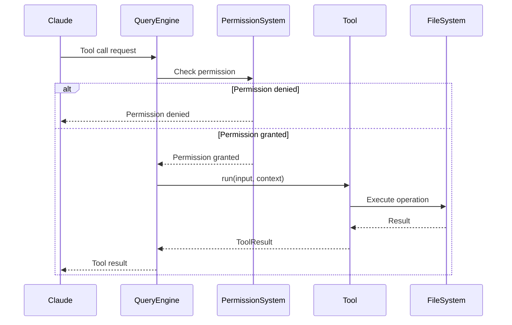

# 第3章：工具系统的核心抽象

> "The right tool for the right job." — Traditional Proverb

工具系统是 Claude Code 的基石。通过工具，Claude 可以与外部世界交互：读写文件、执行命令、搜索代码、访问网络等。本章将深入探讨工具系统的设计哲学、核心抽象和实现细节。

## 3.1 工具的定义与接口

### Tool.ts 的类型系统

所有工具都遵循统一的类型定义：

```typescript
// src/Tool.ts
export type Tool<T extends ZodType<any, any, any> = ZodType<any, any, any>> = {
  // 工具名称（全局唯一标识）
  name: string

  // 工具描述（告诉 AI 这个工具做什么）
  description: string

  // 输入参数的 Schema（Zod）
  inputSchema: T

  // 权限模式（可选）
  permissionMode?: PermissionMode

  // 进度消息（可选，显示给用户）
  progressMessage?: string

  // 执行函数
  run: (input: z.infer<T>, context: ToolUseContext) => Promise<ToolResult>
}
```

**设计要点**：

1. **类型安全**：使用 TypeScript 泛型，确保输入输出的类型正确。
2. **Schema 驱动**：使用 Zod 定义输入参数，自动生成文档和验证。
3. **上下文注入**：通过 `ToolUseContext` 注入依赖，便于测试和扩展。

### 输入 schema 设计

每个工具的输入参数都使用 Zod 定义：

```typescript
// src/tools/BashTool/prompt.ts
import { z } from 'zod'

export const BashToolInputSchema = z.object({
  command: z.string()
    .describe('The command to execute'),

  description: z.string().optional()
    .describe('Clear, concise description of what this command does'),

  timeout: z.number()
    .min(0)
    .max(600000)
    .optional()
    .default(120000)
    .describe('Timeout in milliseconds'),

  dangerouslyDisableSandbox: z.boolean()
    .optional()
    .describe('Set to true to run without sandboxing'),

  run_in_background: z.boolean()
    .optional()
    .describe('Set to true to run in background'),
})

// 从 Schema 自动推导类型
export type BashToolInput = z.infer<typeof BashToolInputSchema>
```

**为什么使用 `.describe()`**：

1. **自动文档**：描述会自动出现在工具文档中。
2. **AI 理解**：Claude 读取描述来理解参数的含义。
3. **一致性**：强制工具作者提供清晰的说明。

### 权限模型

每个工具可以指定自己的权限模式：

```typescript
type PermissionMode =
  | 'default'      // 默认：危险操作需要确认
  | 'plan'         // 规划模式：只读，无副作用
  | 'auto'         // 自动模式：减少确认
  | 'bypass'       // 绕过模式：无需确认（危险！）
```

**示例**：

```typescript
// 只读工具：使用 'plan' 模式
export const FileReadTool: Tool = {
  name: 'Read',
  permissionMode: 'plan',  // 读取文件无副作用
  // ...
}

// 危险工具：使用 'default' 模式
export const BashTool: Tool = {
  name: 'Bash',
  permissionMode: 'default',  // 执行命令需要确认
  // ...
}
```

### 进度状态管理

长时间运行的工具可以报告进度：

```typescript
export interface ToolProgress {
  message: string      // 进度消息
  percentage?: number  // 完成百分比（0-100）
  eta?: number        // 预计剩余时间（秒）
}

export type ToolResult =
  | { output: string; error?: undefined }
  | { output?: string; error: string }

// 工具实现中报告进度
async function run(input, context): Promise<ToolResult> {
  context.reportProgress({ message: 'Starting...', percentage: 0 })

  await doStep1()
  context.reportProgress({ message: 'Step 1 done', percentage: 33 })

  await doStep2()
  context.reportProgress({ message: 'Step 2 done', percentage: 66 })

  await doStep3()
  context.reportProgress({ message: 'Complete', percentage: 100 })

  return { output: 'Done!' }
}
```

## 3.2 工具的执行流程

### 工具调用的生命周期

一个工具从被调用到完成，经历以下阶段：



### 权限检查机制

```typescript
// src/hooks/toolPermission/index.ts
export async function checkToolPermission(
  tool: Tool,
  input: unknown,
  context: ToolUseContext
): Promise<PermissionDecision> {
  // 1. 检查权限模式
  if (tool.permissionMode === 'bypass') {
    return { decision: 'allow' }
  }

  if (tool.permissionMode === 'plan') {
    // 规划模式：只读操作，自动允许
    return { decision: 'allow' }
  }

  // 2. 检查危险操作
  if (isDangerousOperation(tool, input)) {
    // 危险操作：需要用户确认
    return { decision: 'ask_user' }
  }

  // 3. 检查用户配置的权限规则
  const userRule = matchUserPermissionRule(tool, input, context)
  if (userRule) {
    return { decision: userRule.action }
  }

  // 4. 默认：询问用户
  return { decision: 'ask_user' }
}
```

**用户确认流程**：

```typescript
async function askUserPermission(
  tool: Tool,
  input: unknown
): Promise<boolean> {
  // 显示权限提示
  const response = await showPermissionPrompt({
    toolName: tool.name,
    input: input,
    risk: assessRisk(tool, input),
    options: [
      { label: 'Allow', value: 'allow' },
      { label: 'Deny', value: 'deny' },
      { label: 'Allow for session', value: 'allow_session' },
      { label: 'Always allow', value: 'allow_always' },
    ]
  })

  if (response === 'allow_always') {
    // 保存权限规则
    savePermissionRule({
      tool: tool.name,
      pattern: inputPattern,
      action: 'allow'
    })
  }

  return response !== 'deny'
}
```

### 错误处理与重试

工具执行可能失败，需要妥善处理：

```typescript
export interface ToolError extends Error {
  code: string           // 错误代码
  recoverable: boolean   // 是否可恢复
  retryable: boolean     // 是否可重试
  suggestion?: string    // 建议的解决方案
}

async function executeToolWithRetry(
  tool: Tool,
  input: unknown,
  context: ToolUseContext,
  maxRetries = 3
): Promise<ToolResult> {
  let lastError: Error

  for (let attempt = 0; attempt < maxRetries; attempt++) {
    try {
      return await tool.run(input, context)
    } catch (error) {
      lastError = error

      if (!error.retryable) {
        // 不可重试的错误，直接抛出
        throw error
      }

      if (attempt < maxRetries - 1) {
        // 指数退避
        const delay = Math.min(1000 * Math.pow(2, attempt), 10000)
        await sleep(delay)
      }
    }
  }

  // 所有重试都失败
  throw lastError
}
```

### 结果格式化

工具的结果需要格式化，便于 Claude 理解：

```typescript
// 简单文本结果
return {
  output: 'File created successfully'
}

// 结构化结果
return {
  output: JSON.stringify({
    files: ['file1.ts', 'file2.ts'],
    count: 2,
    totalSize: '1.5 MB'
  }, null, 2)
}

// 错误结果
return {
  error: 'Permission denied: cannot write to /etc/hosts'
}
```

## 3.3 核心工具详解

### BashTool - Shell 命令执行

最强大也最危险的工具：

```typescript
export const BashTool: Tool<typeof BashToolInputSchema> = {
  name: 'Bash',
  description: 'Execute shell commands',

  inputSchema: BashToolInputSchema,

  permissionMode: 'default',

  run: async (input, context) => {
    const { command, timeout, dangerouslyDisableSandbox } = input

    // 1. 安全检查
    if (!dangerouslyDisableSandbox) {
      const sandboxed = applySandbox(command)
      if (!sandboxed.safe) {
        return { error: `Unsafe command: ${sandboxed.reason}` }
      }
    }

    // 2. 执行命令
    const result = await execWithTimeout(command, timeout)

    // 3. 处理结果
    if (result.exitCode === 0) {
      return { output: result.stdout }
    } else {
      return {
        output: result.stdout,
        error: `Command failed with exit code ${result.exitCode}: ${result.stderr}`
      }
    }
  }
}
```

**沙箱机制**：

```typescript
function applySandbox(command: string): { safe: boolean; reason?: string } {
  // 禁止的危险命令
  const dangerousPatterns = [
    /rm\s+-rf\s+\//,          // rm -rf /
    />\s*\/dev\/sda/,         // 写入磁盘设备
    /:(){ :|:& };:/,          // Fork bomb
    /curl.*\|\s*bash/,        // 从网络执行脚本
  ]

  for (const pattern of dangerousPatterns) {
    if (pattern.test(command)) {
      return { safe: false, reason: 'Dangerous command pattern detected' }
    }
  }

  return { safe: true }
}
```

### FileReadTool - 文件读取

支持多种文件格式：

```typescript
export const FileReadTool: Tool = {
  name: 'Read',
  description: 'Read a file from the local filesystem',

  run: async (input, context) => {
    const { file_path, limit, offset } = input

    // 1. 检查文件存在
    if (!await exists(file_path)) {
      return { error: `File not found: ${file_path}` }
    }

    // 2. 检测文件类型
    const fileType = await detectFileType(file_path)

    // 3. 根据类型处理
    switch (fileType) {
      case 'image':
        return readImageFile(file_path)

      case 'pdf':
        return readPdfFile(file_path, input.pages)

      case 'notebook':
        return readNotebookFile(file_path)

      default:
        return readTextFile(file_path, limit, offset)
    }
  }
}

// 图片文件：返回 base64 编码
async function readImageFile(path: string): Promise<ToolResult> {
  const buffer = await fs.readFile(path)
  const base64 = buffer.toString('base64')
  const mimeType = getMimeType(path)

  return {
    output: `data:${mimeType};base64,${base64}`
  }
}

// PDF 文件：提取文本
async function readPdfFile(
  path: string,
  pages?: string
): Promise<ToolResult> {
  const pdfBuffer = await fs.readFile(path)
  const pdfData = await pdf(pdfBuffer, { max: 20 })

  let content = ''
  if (pages) {
    // 只读取指定页面
    const pageRange = parsePageRange(pages)
    content = pdfData.text.slice(pageRange.start, pageRange.end)
  } else {
    content = pdfData.text
  }

  return { output: content }
}
```

### FileWriteTool - 文件创建

```typescript
export const FileWriteTool: Tool = {
  name: 'Write',
  description: 'Write content to a file',

  run: async (input, context) => {
    const { file_path, content } = input

    // 1. 检查文件是否存在
    const exists = await fileExists(file_path)

    if (exists) {
      // 2. 如果存在，必须先读取过（防止误覆盖）
      if (!context.hasReadFile(file_path)) {
        return {
          error: 'File already exists. Read it first before overwriting.'
        }
      }
    }

    // 3. 创建父目录
    await fs.mkdir(dirname(file_path), { recursive: true })

    // 4. 写入文件
    await fs.writeFile(file_path, content)

    return { output: `File written: ${file_path}` }
  }
}
```

**安全措施**：

```typescript
// 必须先读取才能写入
if (exists && !context.hasReadFile(file_path)) {
  return { error: 'Read the file first' }
}

// 防止写入敏感位置
const protectedPaths = [
  '/etc/passwd',
  '/etc/hosts',
  '~/.ssh/id_rsa',
]

if (protectedPaths.some(p => file_path.startsWith(p))) {
  return { error: 'Cannot write to protected path' }
}
```

### FileEditTool - 字符串替换编辑

```typescript
export const FileEditTool: Tool = {
  name: 'Edit',
  description: 'Perform exact string replacements in files',

  run: async (input, context) => {
    const { file_path, old_string, new_string, replace_all } = input

    // 1. 读取文件
    const content = await fs.readFile(file_path, 'utf-8')

    // 2. 检查 old_string 是否唯一
    const matches = content.split(old_string)

    if (matches.length === 1) {
      return { error: `String not found: ${old_string}` }
    }

    if (matches.length > 2 && !replace_all) {
      return {
        error: `Found ${matches.length - 1} matches. Use replace_all or provide more context.`
      }
    }

    // 3. 执行替换
    const newContent = replace_all
      ? content.split(old_string).join(new_string)
      : content.replace(old_string, new_string)

    // 4. 写入文件
    await fs.writeFile(file_path, newContent)

    return { output: `Edited ${file_path}` }
  }
}
```

**为什么使用字符串替换而非行号**：

1. **更精确**：字符串匹配比行号更准确。
2. **更安全**：不会因为文件变化导致编辑错位。
3. **更自然**：用户思考和表达时使用的是内容，而非行号。

### GlobTool - 文件模式匹配

```typescript
export const GlobTool: Tool = {
  name: 'Glob',
  description: 'Find files matching a pattern',

  run: async (input, context) => {
    const { pattern, path } = input

    // 使用 fast-glob 库
    const files = await glob(pattern, {
      cwd: path || context.getCwd(),
      absolute: true,
      ignore: ['**/node_modules/**', '**/.git/**'],
    })

    // 按修改时间排序
    const sorted = await sortByModTime(files)

    return { output: sorted.join('\n') }
  }
}
```

### GrepTool - ripgrep 内容搜索

```typescript
export const GrepTool: Tool = {
  name: 'Grep',
  description: 'Search file contents using ripgrep',

  run: async (input, context) => {
    const { pattern, path, output_mode, type } = input

    // 使用 ripgrep (rg 命令)
    const args = [
      '--line-number',
      '--color=never',
      output_mode === 'files_with_matches' ? '--files-with-matches' : '',
      type ? `--type=${type}` : '',
      pattern,
      path || '.'
    ].filter(Boolean)

    const result = await exec('rg', args)

    if (result.exitCode === 0) {
      return { output: result.stdout }
    } else if (result.exitCode === 1) {
      return { output: 'No matches found' }
    } else {
      return { error: result.stderr }
    }
  }
}
```

## 3.4 高级工具设计

### AgentTool - 子 Agent 生成

最复杂的工具，详细设计见第5章：

```typescript
export const AgentTool: Tool = {
  name: 'Agent',
  description: 'Spawn a sub-agent to handle a task',

  run: async (input, context) => {
    const { name, description, prompt, subagent_type } = input

    // 1. 加载 Agent 定义
    const agentDef = subagent_type
      ? await loadAgentDefinition(subagent_type)
      : createForkDefinition(context)

    // 2. 创建独立上下文
    const agentContext = createAgentContext(agentDef, context)

    // 3. 启动 Agent
    const agent = new Agent(agentDef, agentContext)
    await agent.run(prompt)

    // 4. 返回结果路径（不是结果本身！）
    return {
      output: `Agent started. Output will be available at: ${agent.getOutputFile()}`,
      status: 'running'
    }
  }
}
```

### MCPTool - MCP 协议集成

```typescript
export const MCPTool: Tool = {
  name: 'MCP',
  description: 'Call a tool from an MCP server',

  run: async (input, context) => {
    const { server_name, tool_name, arguments: args } = input

    // 1. 获取 MCP 客户端
    const client = await getMCPClient(server_name)

    // 2. 调用工具
    const result = await client.callTool(tool_name, args)

    // 3. 返回结果
    return { output: JSON.stringify(result, null, 2) }
  }
}
```

### LSPTool - Language Server Protocol 集成

```typescript
export const LSPTool: Tool = {
  name: 'LSP',
  description: 'Interact with Language Server Protocol',

  run: async (input, context) => {
    const { operation, file_path, line, character } = input

    // 1. 获取 LSP 客户端
    const client = await getLSPClient(file_path)

    // 2. 执行操作
    switch (operation) {
      case 'goToDefinition':
        return client.goToDefinition(file_path, line, character)

      case 'findReferences':
        return client.findReferences(file_path, line, character)

      case 'hover':
        return client.hover(file_path, line, character)

      // ... 更多操作
    }
  }
}
```

## 3.5 工具注册与管理

### 工具注册表

```typescript
// src/tools.ts
const toolRegistry = new Map<string, Tool>()

export function registerTool(tool: Tool) {
  if (toolRegistry.has(tool.name)) {
    throw new Error(`Tool already registered: ${tool.name}`)
  }
  toolRegistry.set(tool.name, tool)
}

export function getTool(name: string): Tool | undefined {
  return toolRegistry.get(name)
}

export function getAllTools(): Tool[] {
  return Array.from(toolRegistry.values())
}
```

### 条件注册

某些工具只在特定条件下注册：

```typescript
// Ant-only 工具
if (process.env.USER_TYPE === 'ant') {
  registerTool(require('./tools/REPLTool/REPLTool.js').REPLTool)
}

// 特性标志控制
if (feature('PROACTIVE') || feature('KAIROS')) {
  registerTool(require('./tools/SleepTool/SleepTool.js').SleepTool)
}

if (feature('AGENT_TRIGGERS')) {
  registerTool(require('./tools/CronCreateTool/CronCreateTool.js').CronCreateTool)
}
```

### 工具过滤

根据上下文过滤可用工具：

```typescript
function getAvailableTools(
  context: ToolUseContext
): Tool[] {
  const allTools = getAllTools()

  // 1. 应用黑名单
  const disallowedTools = context.getDisallowedTools()
  let available = allTools.filter(t => !disallowedTools.includes(t.name))

  // 2. 应用白名单（如果存在）
  const allowedTools = context.getAllowedTools()
  if (allowedTools && allowedTools.length > 0) {
    available = available.filter(t => allowedTools.includes(t.name))
  }

  // 3. 过滤不可用的 MCP 工具
  const mcpClients = context.getMCPClients()
  const mcpToolNames = mcpClients.flatMap(c => c.tools.map(t => t.name))
  available = available.filter(t =>
    !t.name.startsWith('mcp_') || mcpToolNames.includes(t.name)
  )

  return available
}
```

## 3.6 工具使用的最佳实践

### 安全性优先

```typescript
// ✅ 正确：先检查，再操作
async function safeWrite(path: string, content: string) {
  // 1. 验证路径
  if (!isPathAllowed(path)) {
    throw new Error('Path not allowed')
  }

  // 2. 检查文件存在
  const exists = await fileExists(path)

  // 3. 如果存在，先读取
  if (exists) {
    await Read({ file_path: path })
  }

  // 4. 写入
  return Write({ file_path: path, content })
}
```

### 错误消息友好化

```typescript
// ❌ 错误示例：技术化错误
return { error: 'ENOENT: no such file or directory' }

// ✅ 正确：用户友好的错误
return { error: `File not found: ${file_path}. Please check the path exists.` }
```

### 性能优化

```typescript
// ✅ 正确：使用缓存
async function readFileWithCache(path: string) {
  const cached = cache.get(path)
  if (cached) {
    return cached
  }

  const content = await fs.readFile(path, 'utf-8')
  cache.set(path, content)
  return content
}
```

## 总结

工具系统的设计体现了以下原则：

1. **统一接口**：所有工具遵循相同的接口规范。
2. **类型安全**：TypeScript + Zod 确保类型正确。
3. **安全优先**：权限检查、沙箱机制、输入验证。
4. **可扩展**：注册机制、条件加载、插件支持。
5. **用户友好**：清晰的错误消息、进度报告。

工具系统是 Claude Code 与世界交互的基础，理解工具系统的设计，是理解 Claude Code 的关键。

---

<div style="text-align: center; margin-top: 2rem;">
  <a href="/chapter-02-architecture-overview" style="margin-right: 1rem;">← 第2章</a>
  <a href="/chapter-04-file-tools">第4章：文件操作工具的设计考量 →</a>
</div>
