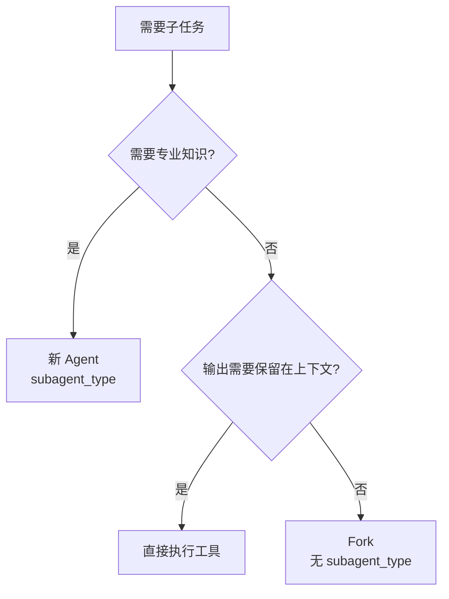

# 第5章：Agent 系统的设计

> "The whole is greater than the sum of its parts." — Aristotle

Agent 系统是 Claude Code 最强大的特性之一。通过 Agent，Claude Code 可以将复杂任务分解、并行执行、专业分工，从而处理超越单次对话能力的复杂工作。

## 5.1 Agent 的定义

### 什么是 Agent？

在 Claude Code 中，Agent 是具有以下特征的执行单元：

1. **独立上下文**：每个 Agent 有自己的对话上下文。
2. **工具访问**：Agent 可以访问特定的一组工具。
3. **专业分工**：不同类型的 Agent 有不同的专长。
4. **生命周期**：Agent 从创建、执行到完成，有完整的生命周期。

### Agent vs Tool 的区别

```typescript
// Tool: 单一功能的执行器
const BashTool = {
  name: 'Bash',
  run: async (input) => {
    // 执行 shell 命令
    return output
  }
}

// Agent: 多步骤任务的执行器
const CodeReviewerAgent = {
  agentType: 'code-reviewer',
  tools: ['Read', 'Grep', 'Glob', 'Bash'],
  run: async (task) => {
    // 1. 读取代码
    const code = await this.tools.Read(file)

    // 2. 分析问题
    const issues = await this.analyze(code)

    // 3. 提出建议
    return this.generateReport(issues)
  }
}
```

**关键区别**：

| 维度 | Tool | Agent |
|------|------|-------|
| 执行粒度 | 单一操作 | 多步骤任务 |
| 上下文 | 共享主上下文 | 独立上下文 |
| 决策能力 | 无 | 有（规划和选择） |
| 工具访问 | 单个工具 | 多个工具的组合 |
| 生命周期 | 短（一次调用） | 长（多轮对话） |

### Agent 的应用场景

Agent 适合处理以下类型的任务：

**1. 研究与调查**：
```
用户：分析这个性能瓶颈在哪里
→ 启动 PerformanceAnalyzer Agent
  → 读取性能日志
  → 分析代码热点
  → 生成优化建议
```

**2. 代码审查**：
```
用户：审查这个 PR 的安全性
→ 启动 SecurityReviewer Agent
  → 读取代码变更
  → 检查常见漏洞
  → 生成审查报告
```

**3. 文档生成**：
```
用户：为这个 API 生成文档
→ 启动 DocWriter Agent
  → 读取代码注释
  → 分析 API 结构
  → 生成 Markdown 文档
```

**4. 测试执行**：
```
用户：运行测试并报告结果
→ 启动 TestRunner Agent
  → 执行测试套件
  → 收集结果
  → 生成测试报告
```

## 5.2 Agent 的生命周期

### 创建与初始化

Agent 通过 `AgentTool` 创建：

```typescript
// 用户调用
Agent({
  subagent_type: 'code-reviewer',  // Agent 类型
  name: 'review-auth',              // 实例名称
  prompt: 'Review the authentication module for security issues'
})

// AgentTool 内部处理
export const AgentTool: Tool = {
  name: 'Agent',
  run: async (input, context) => {
    // 1. 加载 Agent 定义
    const agentDef = await loadAgentDefinition(input.subagent_type)

    // 2. 创建独立上下文
    const agentContext = createAgentContext(agentDef, context)

    // 3. 注入 Memory（如果启用）
    if (agentDef.memory) {
      const memoryPrompt = loadAgentMemoryPrompt(
        input.subagent_type,
        agentDef.memory.scope
      )
      agentContext.systemPrompt += memoryPrompt
    }

    // 4. 启动 Agent
    const agent = new Agent(agentDef, agentContext)
    await agent.run(input.prompt)

    // 5. 返回结果路径（而非结果本身！）
    return {
      output_file: agent.getOutputFile(),
      status: 'running'
    }
  }
}
```

### 上下文传递

Agent 创建时，可以从父 Agent 继承部分上下文：

```typescript
interface AgentContext {
  // 继承的上下文
  inherited: {
    cwd: string              // 工作目录
    projectRoot: string      // 项目根目录
    userPreferences?: string // 用户偏好
  }

  // Agent 专属的上下文
  specific: {
    agentType: string        // Agent 类型
    tools: string[]          // 可用工具
    memory?: MemoryScope     // Memory 配置
  }

  // 不继承的上下文（独立）
  independent: {
    conversationHistory: Message[]  // 对话历史
    toolCallResults: Map<string, any>  // 工具调用结果
  }
}
```

**设计考量**：

- **为什么要继承部分上下文**：避免 Agent 重新学习项目结构、用户偏好等。
- **为什么不继承对话历史**：避免父 Agent 的噪音干扰子 Agent。
- **Memory 的作用**：为 Agent 提供跨会话的持久知识。

### 执行与监控

Agent 的执行是异步的，主 Agent 不会等待：

```typescript
// 主 Agent
async function main() {
  // 启动子 Agent
  const agentFuture = await Agent({
    name: 'research-deps',
    prompt: 'Research dependencies and report security issues'
  })

  // 主 Agent 继续工作
  await doOtherWork()

  // Agent 完成后收到通知
  // 注意：不是通过 agentFuture.getResult() 阻塞等待！
}

// 子 Agent 完成后的通知
system.on('agent_completed', (agentId, result) => {
  console.log(`Agent ${agentId} completed`)
  console.log('Result:', result)
})
```

**为什么不是阻塞等待**：

1. **并行性**：主 Agent 可以在子 Agent 工作时继续处理其他任务。
2. **用户可见性**：用户可以看到多个 Agent 并行工作。
3. **上下文隔离**：子 Agent 的中间过程不会污染主 Agent 的上下文。

### 结果收集与合并

Agent 完成后，结果通过通知机制传递给主 Agent：

```typescript
// Agent 完成通知
interface AgentCompletionNotification {
  agentId: string
  agentType: string
  name: string
  status: 'success' | 'error'
  output_file: string  // 结果文件的路径
  summary: string      // 简短摘要
}

// 主 Agent 收到通知
function handleAgentCompletion(notification: AgentCompletionNotification) {
  if (notification.status === 'success') {
    // 读取完整结果（可选）
    const fullResult = fs.readFileSync(notification.output_file, 'utf-8')

    // 或者只使用摘要
    console.log(notification.summary)
  } else {
    console.error('Agent failed:', notification.summary)
  }
}
```

**设计亮点**：

- **结果分离**：完整结果存在文件中，只传递摘要，减少上下文污染。
- **按需读取**：主 Agent 可以选择是否读取完整结果。
- **失败隔离**：子 Agent 失败不会导致主 Agent 崩溃。

## 5.3 Agent 通信机制

### SendMessageTool - Agent 间消息传递

Agent 之间通过 `SendMessageTool` 传递消息：

```typescript
export const SendMessageTool: Tool = {
  name: 'SendMessage',
  description: 'Send a message to another agent',
  inputSchema: z.object({
    agent_id: z.string().describe('Target agent ID'),
    message: z.string().describe('Message content'),
  }),

  run: async (input, context) => {
    // 验证目标 Agent 存在
    const targetAgent = context.getAgent(input.agent_id)
    if (!targetAgent) {
      throw new Error(`Agent ${input.agent_id} not found`)
    }

    // 发送消息
    await targetAgent.receiveMessage({
      from: context.agentId,
      message: input.message,
      timestamp: Date.now()
    })

    return { status: 'sent' }
  }
}
```

**应用场景**：

```typescript
// Agent A: Coordinator
async function coordinateWork() {
  // 启动多个 Agent
  const research = await Agent({ name: 'research', ... })
  const implement = await Agent({ name: 'implement', ... })

  // 发送消息协调
  await SendMessage({
    agent_id: implement.id,
    message: 'Wait for research to complete before starting'
  })
}
```

### 消息协议设计

```typescript
interface AgentMessage {
  id: string              // 消息 ID
  from: string            // 发送者 Agent ID
  to: string              // 接收者 Agent ID
  type: 'request' | 'response' | 'notification'
  payload: any            // 消息内容
  timestamp: number       // 时间戳
  correlationId?: string  // 关联消息 ID（用于请求-响应模式）
}
```

**消息类型**：

1. **Request**：需要响应的请求。
2. **Response**：对请求的响应。
3. **Notification**：无需响应的通知。

### 并发控制

多个 Agent 可能竞争资源，需要并发控制：

```typescript
// 资源锁
class ResourceLock {
  private locks = new Map<string, Promise<void>>()

  async acquire(resource: string): Promise<ReleaseFunction> {
    // 等待现有锁释放
    while (this.locks.has(resource)) {
      await this.locks.get(resource)
    }

    // 创建新锁
    let release: () => void
    const promise = new Promise<void>(resolve => {
      release = resolve
    })
    this.locks.set(resource, promise)

    // 返回释放函数
    return () => {
      this.locks.delete(resource)
      release()
    }
  }
}

// 使用示例
async function editFile(file: string) {
  const release = await lock.acquire(file)
  try {
    // 安全地编辑文件
    await fs.writeFile(file, content)
  } finally {
    release()
  }
}
```

### 错误传播

Agent 失败时的错误处理策略：

```typescript
interface AgentError extends Error {
  agentId: string
  agentType: string
  phase: 'initialization' | 'execution' | 'cleanup'
  recoverable: boolean
  suggestion?: string
}

async function handleAgentError(error: AgentError) {
  console.error(`Agent ${error.agentId} failed:`, error.message)

  if (error.recoverable) {
    // 可恢复：重试或使用替代方案
    console.log('Attempting recovery:', error.suggestion)
  } else {
    // 不可恢复：通知用户
    throw new Error(`Unrecoverable agent failure: ${error.message}`)
  }
}
```

## 5.4 Fork Subagent 机制

### When to fork 的判断标准

Fork 是 AgentTool 的一个高级特性，允许主 Agent 创建轻量级的子 Agent：

```typescript
// Fork vs 新 Agent
const agentResult = await Agent({
  subagent_type: 'code-reviewer',  // 新 Agent
  prompt: 'Review the code'
})

const forkResult = await Agent({
  name: 'quick-check',  // Fork（无 subagent_type）
  prompt: 'Check if tests pass'
})
```

**Fork 的判断标准**：

```typescript
const whenToForkSection = `
## When to fork

Fork yourself (omit \`subagent_type\`) when the intermediate tool output isn't worth keeping in your context.
The criterion is qualitative — "will I need this output again" — not task size.

- **Research**: fork open-ended questions. If research can be broken into independent questions, launch parallel forks in one message.
- **Implementation**: prefer to fork implementation work that requires more than a couple of edits.
`
```

### Fork vs 新 Agent 的选择

```typescript
// Fork: 共享上下文，共享 Prompt Cache
const fork = await Agent({
  name: 'analyze-deps',
  prompt: 'Analyze dependencies'  // 继承父 Agent 的上下文
})
// 优势：快速启动，成本低（共享 cache）
// 劣势：子 Agent 的上下文会污染父 Agent

// 新 Agent: 独立上下文，独立 Prompt Cache
const newAgent = await Agent({
  subagent_type: 'security-scanner',
  prompt: 'Scan for vulnerabilities'  // 从零开始
})
// 优势：完全隔离，专业能力
// 劣势：启动慢，成本高（新 cache）
```

**决策树**：



### Context 继承与隔离

Fork 继承父 Agent 的上下文：

```typescript
// 父 Agent
const context = {
  cwd: '/project',
  conversationHistory: [...],  // 对话历史
  toolCallResults: Map {...},  // 工具调用结果
  memory: 'user preferences...'
}

// Fork 的上下文
const forkContext = {
  cwd: '/project',              // 继承
  conversationHistory: [...],   // 继承（共享）
  toolCallResults: Map {...},   // 继承（共享）
  memory: 'user preferences...' // 继承
}

// 新 Agent 的上下文
const newAgentContext = {
  cwd: '/project',              // 继承
  conversationHistory: [],      // 空的！
  toolCallResults: Map {},      // 空的！
  memory: undefined             // 无（除非配置）
}
```

**关键区别**：

- Fork：共享 `conversationHistory` 和 `toolCallResults`，因此可以共享 Prompt Cache。
- 新 Agent：独立的 `conversationHistory` 和 `toolCallResults`，无法共享 Prompt Cache。

### Prompt Cache 共享

Prompt Cache 是 Claude API 的一个重要特性，可以缓存部分提示词，减少重复计算：

```typescript
// 父 Agent 的提示词
const parentPrompt = [
  { role: 'system', content: 'You are Claude...', cache_control: { type: 'ephemeral' } },
  { role: 'user', content: 'Analyze the project' },
  // ... 对话历史
]

// Fork 的提示词（可以命中缓存）
const forkPrompt = [
  { role: 'system', content: 'You are Claude...', cache_control: { type: 'ephemeral' } },  // 缓存命中！
  { role: 'user', content: 'Fork task: Check tests' },  // 新内容
]

// 新 Agent 的提示词（无法命中缓存）
const newAgentPrompt = [
  { role: 'system', content: 'You are a code reviewer...', cache_control: { type: 'ephemeral' } },  // 新的系统提示词，无法缓存
  { role: 'user', content: 'Review the code' },
]
```

**成本对比**：

| 方案 | 输入 Token | Cache 命中 | 实际成本 |
|------|-----------|-----------|---------|
| Fork | 10,000 | 8,000 (80%) | 2,000 tokens |
| 新 Agent | 10,000 | 0 (0%) | 10,000 tokens |

## 5.5 Agent 提示词设计

### 编写 Agent 提示词的原则

```typescript
const writingThePromptSection = `
## Writing the prompt

Brief the agent like a smart colleague who just walked into the room.
- Explain what you're trying to accomplish and why.
- Describe what you've already learned or ruled out.
- Give enough context about the surrounding problem.
- If you need a short response, say so ("report in under 200 words").

Terse command-style prompts produce shallow, generic work.

**Never delegate understanding.** Don't write "based on your findings, fix the bug."
Those phrases push synthesis onto the agent instead of doing it yourself.
`
```

### 提示词模板

**研究型 Agent**：

```typescript
const prompt = `
Your task: ${taskDescription}

Context:
- Working directory: ${cwd}
- What we've tried: ${attempts}
- What we know so far: ${knownFacts}
- What we suspect but haven't confirmed: ${hypotheses}

Your deliverable:
- A clear answer to the question
- Evidence to support your conclusion
- If uncertain, what additional information would help

Constraints:
- Under ${wordLimit} words
- Focus on actionable findings
- Cite specific files/lines when relevant
`
```

**执行型 Agent**：

```typescript
const prompt = `
Your task: Implement ${feature}

Requirements:
- ${requirement1}
- ${requirement2}

Context:
- Related code: ${relatedFiles}
- Existing patterns to follow: ${patterns}
- Tests must pass: ${testCommand}

Approach:
1. Start by reading ${startingPoint}
2. Implement the core logic
3. Add tests
4. Run ${testCommand} to verify

Constraints:
- Do NOT modify ${protectedFiles}
- Follow the existing code style
- Keep changes minimal and focused
`
```

### 提示词的反模式

❌ **错误示例**：

```typescript
// 太简单，Agent 无法理解背景
const badPrompt = 'Fix the bug'

// 太模糊，Agent 不知道要做什么
const badPrompt = 'Improve the code quality'

// 太复杂，Agent 会迷失
const badPrompt = `
First, read all the files in the project.
Then, understand the entire architecture.
After that, find all the bugs.
Finally, fix everything and make it perfect.
`
```

✅ **正确示例**：

```typescript
// 清晰、具体、有边界
const goodPrompt = `
Fix the authentication bug in src/auth/login.ts:

Problem: Users are logged out unexpectedly after 5 minutes
Expected: Session should last 24 hours

What I've tried:
- Increased SESSION_TIMEOUT to 86400 (24 hours)
- But users still get logged out after 5 minutes

Please:
1. Find why the session expires early
2. Fix the root cause
3. Add a test to prevent regression

Constraint: Do NOT modify the cookie logic (it's working correctly)
`
```

## 5.6 Agent 的实现示例

### 自定义 Agent 定义

```typescript
// agents/code-reviewer.md
---
agentType: code-reviewer
whenToUse: Use this agent when you need a thorough code review
tools:
  - Read
  - Grep
  - Glob
  - Bash
memory:
  scope: project
---

You are a code reviewer specialized in finding issues and suggesting improvements.

Your responsibilities:
1. Read and understand the code changes
2. Identify potential bugs, security issues, and performance problems
3. Suggest improvements following best practices
4. Generate a clear, actionable review report

Review checklist:
- Correctness: Does the code do what it's supposed to do?
- Security: Are there any security vulnerabilities?
- Performance: Are there any performance bottlenecks?
- Maintainability: Is the code easy to understand and modify?
- Testing: Are there sufficient tests?

Output format:
- Start with a summary
- List issues by severity (Critical > Major > Minor > Suggestion)
- Provide specific line numbers and code snippets
- Suggest concrete fixes
```

### 加载 Agent 定义

```typescript
// src/tools/AgentTool/loadAgentsDir.ts
export interface AgentDefinition {
  agentType: string
  whenToUse: string
  tools?: string[]
  disallowedTools?: string[]
  memory?: {
    scope: 'user' | 'project' | 'local'
  }
  prompt: string  // Agent 的系统提示词
}

export async function loadAgentDefinition(
  agentType: string
): Promise<AgentDefinition> {
  // 1. 查找 Agent 定义文件
  const agentFile = findAgentFile(agentType)

  // 2. 解析 frontmatter 和内容
  const { frontmatter, content } = parseFrontmatter(agentFile)

  // 3. 构建完整提示词
  const prompt = buildAgentPrompt(frontmatter, content)

  return {
    agentType: frontmatter.agentType,
    whenToUse: frontmatter.whenToUse,
    tools: frontmatter.tools,
    disallowedTools: frontmatter.disallowedTools,
    memory: frontmatter.memory,
    prompt
  }
}
```

## 5.7 Agent 系统的最佳实践

### 何时使用 Agent

**适合使用 Agent 的场景**：

✅ 复杂的多步骤任务
✅ 需要专业知识的任务
✅ 可以并行执行的任务
✅ 结果不需要立即使用的任务

**不适合使用 Agent 的场景**：

❌ 简单的单步操作（直接用工具）
❌ 需要立即结果的任务
❌ 高度依赖上下文的任务（除非用 Fork）

### Agent 数量控制

```typescript
// ❌ 错误：启动太多 Agent
for (const file of files) {
  await Agent({ prompt: `Analyze ${file}` })  // 100+ Agent 同时运行！
}

// ✅ 正确：分批执行
const BATCH_SIZE = 5
for (let i = 0; i < files.length; i += BATCH_SIZE) {
  const batch = files.slice(i, i + BATCH_SIZE)
  await Promise.all(batch.map(file =>
    Agent({ prompt: `Analyze ${file}` })
  ))
}
```

### Agent 超时设置

```typescript
// 为 Agent 设置合理的超时
const result = await Agent({
  prompt: 'Analyze the codebase',
  timeout: 300000  // 5 分钟
})
```

## 总结

Agent 系统的设计体现了 Claude Code 的核心理念：

1. **分而治之**：复杂任务分解为多个子任务。
2. **专业分工**：不同类型的 Agent 有不同的专长。
3. **并行执行**：多个 Agent 同时工作，提升效率。
4. **上下文隔离**：Agent 之间不互相干扰。
5. **成本优化**：Fork 机制共享 Prompt Cache，降低成本。

通过 Agent 系统，Claude Code 能够处理远超单次对话能力的复杂任务，真正成为开发者的智能伙伴。

---

<div style="text-align: center; margin-top: 2rem;">
  <a href="/chapter-04-file-tools" style="margin-right: 1rem;">← 第4章</a>
  <a href="/chapter-06-multi-agent-collaboration">第6章：多 Agent 协作模式 →</a>
</div>
