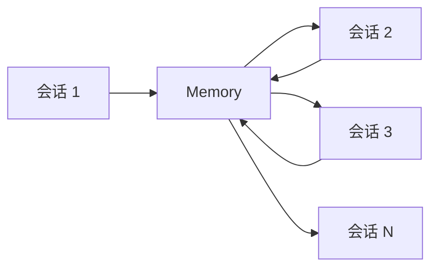

# 第7章：Memory 系统的哲学

> "Memory is the treasury and guardian of all things." — Cicero

Memory 系统是 Claude Code 实现长期学习和适应的关键。通过 Memory，Claude Code 可以跨会话保留知识，逐渐理解用户的偏好、项目的特性和团队的约定，从而提供越来越个性化和精准的服务。

## 7.1 为什么需要 Memory

### 上下文的局限性

Claude 的上下文窗口虽然很大（200K tokens），但仍然是有限的。每次对话结束后，上下文就会丢失：

```
会话 1: 用户偏好、项目背景 → 对话结束 → 丢失
会话 2: 重新学习用户偏好、项目背景 → 对话结束 → 丢失
会话 3: 再次重新学习... → 无限循环
```

这种模式导致：

1. **重复劳动**：每次会话都要重新解释相同的背景。
2. **成本浪费**：重复的上下文占用宝贵的 token 配额。
3. **体验不佳**：用户需要反复说明需求和偏好。
4. **无法改进**：Claude 无法从过去的错误中学习。

### 跨会话的知识积累

Memory 系统通过持久化存储，打破了会话的边界：



**Memory 的价值**：

```typescript
// 会话 1: Claude 学习用户的偏好
用户：我喜欢函数式编程风格，避免使用 class
Claude: [保存到 Memory]
  type: feedback
  content: 用户偏好函数式编程，避免 class

// 会话 2（一周后）: Claude 记住了偏好
用户：帮我实现一个用户管理模块
Claude: [读取 Memory]
  我将使用函数式风格实现，避免使用 class...
用户：完美！正是我想要的
```

### 个性化与团队协作

Memory 系统支持不同的作用域（Scope），实现个性化与团队协作的平衡：

```typescript
// User Scope: 个人偏好，跨项目共享
~/.claude/memory/
  └── projects/
      └── user-preferences.md  // "我喜欢详细的代码注释"

// Project Scope: 项目知识，团队共享
project/.claude/memory/
  └── project-conventions.md  // "团队约定：使用 Zod 验证所有输入"

// Local Scope: 本地环境，不提交到 Git
project/.claude/memory-local/
  └── local-setup.md  // "本地开发环境使用 Docker"
```

**作用域选择**：

| Scope | 位置 | 共享 | 适用场景 |
|-------|------|------|---------|
| User | `~/.claude/` | 仅自己 | 个人偏好、习惯 |
| Project | `.claude/` | 团队（Git） | 项目约定、决策 |
| Local | `.claude-local/` | 仅本地 | 本地环境配置 |

### 学习与改进

Memory 系统不仅存储事实，还存储反馈：

```typescript
// 用户纠正 Claude 的行为
用户：不要在生产环境使用 console.log，用 logger 替代
Claude: [保存到 Memory]
  type: feedback
  content: 在生产环境使用 logger，而非 console.log
  why: 用户指出 console.log 不适合生产环境

// 未来会话中，Claude 自动应用这个规则
Claude: 我注意到您在开发环境使用 console.log 调试。
        在生产环境，我将使用 logger...
```

## 7.2 Memory 的分类

Claude Code 定义了四种类型的 Memory，每种都有明确的用途：

### User Memory - 用户偏好与背景

**定义**：包含用户的角色、目标、责任和知识。

**目的**：帮助 Claude 理解用户是谁，如何最好地提供帮助。

```typescript
const userMemoryExample = `
---
name: user-preferences
type: user
---

## 用户背景
- 角色：高级后端工程师，5年 Go 经验
- 当前项目：微服务架构的电商平台
- 技术栈：Go, PostgreSQL, Redis, Kafka

## 沟通偏好
- 喜欢简洁的技术解释，不需要基础概念科普
- 代码示例优于长篇描述
- 希望提前告知潜在风险

## 领域知识
- 精通分布式系统设计
- 熟悉事件溯源和 CQRS
- 对 React 前端较陌生
`
```

**何时保存**：

- 用户提及自己的角色、经验背景
- 用户表达对沟通方式的偏好
- 用户展示特定的知识盲区

**如何使用**：

- 调整解释的深度和方式
- 选择合适的代码示例
- 避免推荐用户已知的技术

### Feedback Memory - 反馈与改进

**定义**：用户给出的关于如何工作的指导——包括避免什么和继续做什么。

**目的**：让 Claude 的行为与用户的期望保持一致。

```typescript
const feedbackMemoryExample = `
---
name: testing-approach
type: feedback
---

## 测试策略
- 在这个项目中，集成测试必须使用真实数据库，而非 mock
- 原因：去年发生过 mock 测试通过但生产环境失败的事故
- 适用场景：所有涉及数据库操作的测试

## 代码风格
- 单个 PR 应该控制在合理规模，避免超大型重构
- 原因：大型 PR 难以审查，容易引入 bug
- 适用场景：所有 PR 的规模控制
`
```

**何时保存**：

- 用户纠正 Claude 的行为（"不要这样做"、"这样做更好"）
- 用户确认非显而易见的方法有效（"是的，这正是我想要的"）
- 用户提出特定的约定或规则

**如何使用**：

- 自动应用用户指定的规则
- 避免重复相同的错误
- 在相关场景中应用成功的方法

### Project Memory - 项目状态与决策

**定义**：关于项目中正在进行的工作、目标、计划、bug 或事件的信息。

**目的**：帮助 Claude 理解项目的当前状态和背景。

```typescript
const projectMemoryExample = `
---
name: current-sprint
type: project
---

## Sprint 目标（2026-04-01 ~ 2026-04-15）
- 完成用户认证模块的重构
- 集成 OAuth 2.0 登录
- 修复性能瓶颈（响应时间 > 500ms）

## 关键决策
- 使用 JWT 而非 session（原因：微服务架构，无状态更好）
- 认证服务独立部署（原因：单点登录需求）

## 已知问题
- 当前登录 API 在高并发下有性能问题
- Token 刷新逻辑有 race condition

## 注意事项
- 周四（2026-04-03）会冻结代码，准备发布
`
```

**何时保存**：

- 用户提及项目的目标、计划、截止日期
- 用户解释技术决策的原因
- 用户描述当前的问题或障碍

**如何使用**：

- 理解任务的优先级和背景
- 做出符合项目目标的决策
- 避免与已知决策冲突

### Reference Memory - 外部资源引用

**定义**：指向外部系统中信息的指针。

**目的**：帮助 Claude 找到项目目录外的最新信息。

```typescript
const referenceMemoryExample = `
---
name: external-resources
type: reference
---

## Bug 追踪
- Linear 项目：INGEST（所有 pipeline 相关的 bug）
  - https://linear.app/company/project/INGEST

## 文档资源
- API 文档：https://docs.internal.company.com/api
- 架构决策记录：https://confluence.company.com/display/ARCH

## 监控仪表板
- Grafana：https://grafana.internal/d/api-latency
  - 这是 on-call 团队监控的仪表板
  - 如果修改请求处理逻辑，检查这个仪表板

## CI/CD
- GitHub Actions：.github/workflows/
- 部署流程：https://wiki.company.com/deployment
`
```

**何时保存**：

- 用户提及外部系统的位置和用途
- 用户解释在哪里找到特定的信息
- 用户指出重要的监控或日志位置

**如何使用**：

- 当用户引用外部系统时，知道在哪里查找
- 理解外部资源与当前任务的关系

## 7.3 Memory 的存储策略

### Scope 的概念 (user/project/local)

Memory 有三个作用域，分别对应不同的共享级别：

```typescript
export type MemoryScope = 'user' | 'project' | 'local'

export function getMemoryDir(scope: MemoryScope): string {
  switch (scope) {
    case 'user':
      // 用户级别：跨所有项目共享
      return join(getMemoryBaseDir(), 'memory/')

    case 'project':
      // 项目级别：团队共享（提交到 Git）
      return join(getCwd(), '.claude/memory/')

    case 'local':
      // 本地级别：仅本机（不提交到 Git）
      return join(getCwd(), '.claude/memory-local/')
  }
}
```

**目录结构**：

```
~/.claude/                          # User Scope
├── memory/
│   └── projects/
│       └── <project-slug>/
│           ├── MEMORY.md           # 入口文件
│           ├── user/
│           │   └── preferences.md
│           └── feedback/
│               └── coding-style.md

project-root/.claude/               # Project Scope
├── memory/
│   ├── MEMORY.md
│   ├── project/
│   │   ├── current-sprint.md
│   │   └── architecture.md
│   └── reference/
│       └── external-resources.md

project-root/.claude/memory-local/  # Local Scope
└── local-setup.md
```

### Team vs Private Memory

当启用团队 Memory 时，有两种类型：

```typescript
// Team Memory: 提交到 Git，团队成员共享
// 位置：project/.claude/memory/team/
// 用途：项目约定、团队决策、共享的参考

// Private Memory: 不提交到 Git，仅个人可见
// 位置：~/.claude/memory/projects/<slug>/private/
// 用途：个人偏好、私密反馈
```

**冲突处理**：

```typescript
// Private Memory 可以覆盖 Team Memory
// Team: "使用 2 空格缩进"
// Private: "我偏好 4 空格缩进（在个人项目中）"
// 结果：Private 优先生效
```

### 存储位置与命名

Memory 文件遵循命名约定：

```typescript
// 入口文件：MEMORY.md（限制 200 行或 25KB）
// 主题文件：<category>/<topic>.md

// 示例
memory/
├── MEMORY.md                    # 入口文件（索引）
├── user/
│   └── preferences.md          # 用户偏好
├── feedback/
│   ├── coding-style.md         # 编码风格反馈
│   └── testing-approach.md     # 测试策略反馈
├── project/
│   ├── current-sprint.md       # 当前冲刺
│   └── architecture.md         # 架构决策
└── reference/
    ├── external-resources.md    # 外部资源
    └── monitoring.md            # 监控链接
```

### 版本控制集成

**Project Scope** 应该提交到 Git：

```bash
# .gitignore
.claude/memory-local/  # 排除本地 Memory

# Git 提交
git add .claude/memory/
git commit -m "Update project memory: architecture decisions"
```

**User Scope** 不会提交到 Git（在用户主目录）：

```bash
# User Memory 在 ~/.claude/
# 独立于任何 Git 仓库
```

## 7.4 Memory 的生命周期

### 创建与更新

Memory 通过两种方式创建和更新：

**1. 自动提取**：

```typescript
// src/services/extractMemories/index.ts
export async function extractMemories(
  conversation: Message[]
): Promise<MemoryEntry[]> {
  // 1. 分析对话，识别值得记忆的内容
  const candidates = analyzeConversation(conversation)

  // 2. 过滤：排除可推导的内容
  const memories = candidates.filter(c =>
    !isDerivableFromCode(c) &&
    !isDerivableFromGitHistory(c)
  )

  // 3. 用户确认
  for (const memory of memories) {
    const confirmed = await askUserConfirmation(memory)
    if (confirmed) {
      await saveMemory(memory)
    }
  }

  return memories
}
```

**2. 手动管理**：

```bash
# 使用命令手动管理
/memory add "I prefer functional programming style"
/memory list
/memory edit user/preferences.md
/memory remove feedback/old-style.md
```

### 过期与清理

Memory 可能过期，需要定期清理：

```typescript
interface MemoryMetadata {
  created: Date
  lastAccessed: Date
  expires?: Date  // 可选的过期时间
}

// Project Memory 通常有过期时间
const sprintMemory = {
  content: "Sprint goal: Complete auth refactoring by 2026-04-15",
  expires: new Date('2026-04-16'),  // Sprint 结束后过期
  type: 'project'
}

// 自动清理过期的 Memory
async function cleanupExpiredMemories() {
  const memories = await loadAllMemories()
  const expired = memories.filter(m =>
    m.expires && m.expires < new Date()
  )

  for (const memory of expired) {
    await archiveMemory(memory)
  }
}
```

### 冲突解决

当多个 Memory 冲突时：

```typescript
// 优先级：Private > Team > User
// 新 > 旧
// 具体 > 一般

function resolveConflict(memories: Memory[]): Memory {
  // 1. 按 scope 排序
  memories.sort((a, b) => {
    const scopePriority = { private: 3, team: 2, user: 1 }
    return scopePriority[b.scope] - scopePriority[a.scope]
  })

  // 2. 按时间排序（新的优先）
  memories.sort((a, b) => b.updatedAt - a.updatedAt)

  // 3. 返回优先级最高的
  return memories[0]
}
```

### 隐私保护

Memory 系统遵循隐私优先原则：

```typescript
// 1. 明确告知用户
"我注意到您提到了一些偏好，是否保存到 Memory？"

// 2. 用户可控
/memory disable    # 禁用 Memory
/memory enable     # 启用 Memory
/memory clear      # 清空所有 Memory

// 3. 敏感信息过滤
function sanitizeMemory(content: string): string {
  // 移除 API keys
  content = content.replace(/sk-[a-zA-Z0-9]+/g, '[API_KEY]')

  // 移除密码
  content = content.replace(/password:\s*\S+/gi, 'password: [REDACTED]')

  return content
}
```

## 7.5 Memory 的设计哲学

### 不保存可推导的内容

Memory 系统的一个核心原则是：**不保存可以从代码或 Git 历史推导的内容**。

```typescript
const WHAT_NOT_TO_SAVE = `
## What NOT to save in memory

- Code patterns, conventions, architecture → derivable from reading the code
- Git history, recent changes, who-changed-what → derivable from git log/blame
- Debugging solutions or fix recipes → the fix is in the code; the commit message has the context
- Anything already documented in CLAUDE.md files
- Ephemeral task details: in-progress work, temporary state, current conversation context
`
```

**为什么**：

1. **避免冗余**：代码本身就是最好的文档。
2. **保持同步**：代码变更时，Memory 不会过时。
3. **节省空间**：Memory 窗口有限，应该留给真正重要的内容。

### 分类即约束

四种 Memory 类型不是任意的，而是经过深思熟虑的分类：

```typescript
// user: 关于用户的事实（偏好、背景）
// feedback: 关于行为的指导（应该/不应该做什么）
// project: 关于项目的状态（当前发生了什么）
// reference: 关于外部资源的指针（在哪里找到信息）

// 这四种类型覆盖了 AI 需要知道的所有非技术性信息
```

**设计意图**：

- **user**: 帮助 AI 理解"谁"
- **feedback**: 帮助 AI 理解"如何"
- **project**: 帮助 AI 理解"什么"
- **reference**: 帮助 AI 理解"哪里"

### 指导即赋能

Memory 不仅是存储，更是指导：

```typescript
// 每个 Memory 条目包含：
// 1. 内容（what）
// 2. 何时保存（when_to_save）
// 3. 如何使用（how_to_use）
// 4. 为什么（why）

const feedbackMemoryTemplate = `
Lead with the rule itself, then a **Why:** line (the reason the user gave)
and a **How to apply:** line (when/where this guidance kicks in).

Example:
"Use logger instead of console.log in production code.
**Why:** User pointed out that console.log is not suitable for production.
**How to apply:** Replace console.log with logger.log in all production code paths."
`
```

## 总结

Memory 系统的设计哲学可以总结为：

1. **跨会话持久化**：打破对话的临时性，实现长期学习。
2. **类型化分类**：四种类型覆盖所有非技术性信息。
3. **作用域隔离**：User/Project/Local 三层作用域，平衡个性化与协作。
4. **避免冗余**：不保存可推导的内容，保持 Memory 的价值密度。
5. **指导优先**：Memory 不仅描述"是什么"，还指导"如何用"。
6. **隐私优先**：用户知情、可控，敏感信息过滤。

通过 Memory 系统，Claude Code 真正实现了从工具到伙伴的转变——它不仅帮你完成任务，还在学习和适应你的工作方式。

---

<div style="text-align: center; margin-top: 2rem;">
  <a href="/chapter-06-multi-agent-collaboration" style="margin-right: 1rem;">← 第6章</a>
  <a href="/chapter-08-memory-implementation">第8章：Memory 系统的实现 →</a>
</div>
