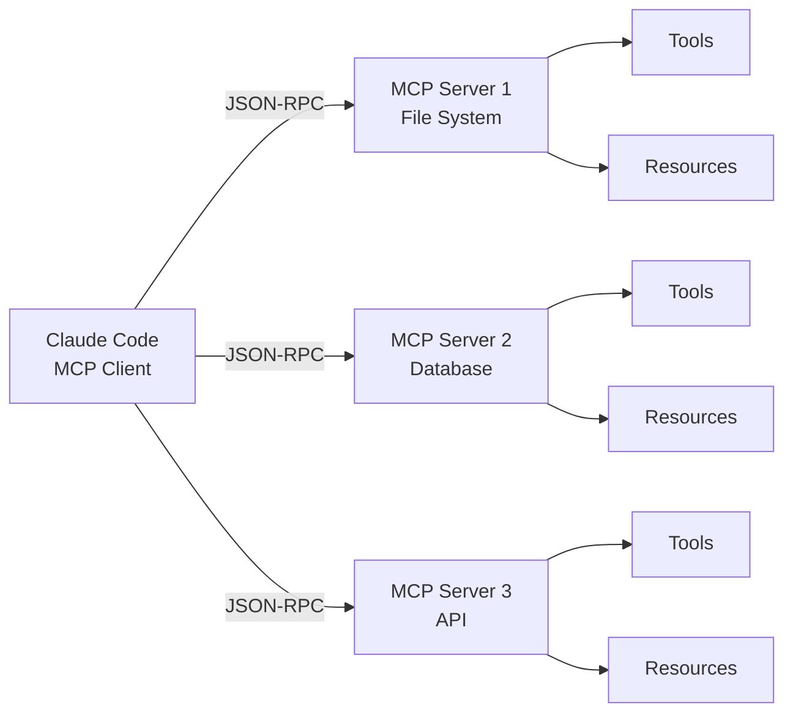

# 第11章：MCP 协议集成

> "Standards are always out of date. That's what makes them standards." — Alan Bennett

Model Context Protocol (MCP) 是 Anthropic 推出的开放协议，用于连接 AI 助手与外部数据源和工具。Claude Code 通过 MCP 实现了强大的扩展能力。

## 11.1 MCP 协议概述

### 什么是 MCP

MCP (Model Context Protocol) 是一个开放标准，定义了 AI 应用如何与外部系统交互：

```typescript
// MCP 的核心概念
interface MCPServer {
  // 服务器信息
  name: string
  version: string

  // 提供的能力
  capabilities: {
    tools?: boolean      // 工具支持
    resources?: boolean  // 资源支持
    prompts?: boolean    // 提示词支持
  }

  // 方法
  listTools(): Promise<Tool[]>
  callTool(name: string, args: any): Promise<any>

  listResources(): Promise<Resource[]>
  readResource(uri: string): Promise<any>

  listPrompts(): Promise<Prompt[]>
  getPrompt(name: string, args: any): Promise<string>
}
```

### 为什么选择 MCP

```typescript
// 传统方案的问题
const traditionalApproach = {
  problems: [
    '每个工具都需要单独集成',
    '接口不统一，维护成本高',
    '无法跨应用复用',
    '版本管理困难',
  ]
}

// MCP 的优势
const mcpAdvantages = {
  benefits: [
    '标准化协议，一次集成到处使用',
    '解耦 AI 应用与工具实现',
    '支持多种传输方式（stdio, HTTP, WebSocket）',
    '版本化，向后兼容',
    '开源生态，社区驱动',
  ]
}
```

### 协议的核心概念



**核心组件**：

1. **Tools（工具）**：可执行的函数，带有参数 schema。
2. **Resources（资源）**：可读取的数据源，类似文件。
3. **Prompts（提示词）**：预定义的提示词模板。

## 11.2 MCP Server 连接

### Server 发现与注册

```typescript
// src/services/mcp/index.ts
export class MCPManager {
  private servers = new Map<string, MCPServerConnection>()

  async discoverServers(): Promise<MCPServerConfig[]> {
    // 1. 从配置文件读取
    const configPath = join(getConfigDir(), 'mcp_servers.json')
    const config = await fs.readJson(configPath)

    // 2. 发现服务器
    const servers: MCPServerConfig[] = []

    for (const [name, serverConfig] of Object.entries(config.servers)) {
      servers.push({
        name,
        transport: serverConfig.transport,
        command: serverConfig.command,
        args: serverConfig.args,
        env: serverConfig.env,
      })
    }

    return servers
  }

  async registerServer(config: MCPServerConfig): Promise<void> {
    const connection = await this.connect(config)
    this.servers.set(config.name, connection)

    // 注册工具
    const tools = await connection.listTools()
    for (const tool of tools) {
      this.registerTool(config.name, tool)
    }

    // 注册资源
    const resources = await connection.listResources()
    for (const resource of resources) {
      this.registerResource(config.name, resource)
    }
  }
}
```

### 连接管理

```typescript
// src/services/mcp/connection.ts
export class MCPServerConnection {
  private transport: Transport
  private requestId = 0

  constructor(private config: MCPServerConfig) {}

  async connect(): Promise<void> {
    // 根据传输类型创建连接
    switch (this.config.transport) {
      case 'stdio':
        this.transport = new StdioTransport(this.config)
        break

      case 'http':
        this.transport = new HTTPTransport(this.config)
        break

      case 'websocket':
        this.transport = new WebSocketTransport(this.config)
        break

      default:
        throw new Error(`Unknown transport: ${this.config.transport}`)
    }

    await this.transport.connect()

    // 初始化握手
    await this.initialize()
  }

  private async initialize(): Promise<void> {
    // 发送 initialize 请求
    const response = await this.sendRequest('initialize', {
      protocolVersion: '2024-11-05',
      clientInfo: {
        name: 'Claude Code',
        version: getVersion(),
      },
      capabilities: {
        tools: {},
        resources: {},
      },
    })

    // 验证服务器能力
    if (!response.result) {
      throw new Error('Initialization failed')
    }
  }

  async sendRequest(method: string, params: any): Promise<any> {
    const id = this.requestId++
    const request = {
      jsonrpc: '2.0',
      id,
      method,
      params,
    }

    return this.transport.send(request)
  }
}
```

### 错误处理

```typescript
// MCP 错误类型
interface MCPError {
  code: number
  message: string
  data?: any
}

// 错误代码
const MCP_ERROR_CODES = {
  PARSE_ERROR: -32700,
  INVALID_REQUEST: -32600,
  METHOD_NOT_FOUND: -32601,
  INVALID_PARAMS: -32602,
  INTERNAL_ERROR: -32603,
  SERVER_ERROR_START: -32000,
  SERVER_ERROR_END: -32099,
}

async function handleMCPError(error: MCPError): Promise<void> {
  switch (error.code) {
    case MCP_ERROR_CODES.METHOD_NOT_FOUND:
      console.warn(`MCP method not found: ${error.message}`)
      break

    case MCP_ERROR_CODES.SERVER_ERROR_START:
      // 服务器错误，可能需要重连
      await this.reconnect()
      break

    default:
      console.error('MCP error:', error)
  }
}
```

### 性能监控

```typescript
// MCP 性能监控
class MCPMonitor {
  private metrics = new Map<string, Metric>()

  trackRequest(server: string, method: string, duration: number): void {
    const key = `${server}:${method}`
    const metric = this.metrics.get(key) || {
      count: 0,
      totalDuration: 0,
      errors: 0,
    }

    metric.count++
    metric.totalDuration += duration

    this.metrics.set(key, metric)
  }

  getMetrics(): MetricReport {
    const report: MetricReport = {}

    for (const [key, metric] of this.metrics.entries()) {
      const [server, method] = key.split(':')
      if (!report[server]) report[server] = {}

      report[server][method] = {
        count: metric.count,
        avgDuration: metric.totalDuration / metric.count,
        errorRate: metric.errors / metric.count,
      }
    }

    return report
  }
}
```

## 11.3 MCP Tool 调用

### Tool 映射

```typescript
// src/tools/MCPTool/MCPTool.ts
export const MCPTool: Tool = {
  name: 'MCP',
  description: 'Call a tool from an MCP server',

  inputSchema: z.object({
    server_name: z.string().describe('Name of the MCP server'),
    tool_name: z.string().describe('Name of the tool to call'),
    arguments: z.record(any).describe('Arguments for the tool'),
  }),

  run: async (input, context) => {
    const { server_name, tool_name, arguments: args } = input

    // 1. 获取 MCP 连接
    const connection = await getMCPConnection(server_name)
    if (!connection) {
      return { error: `MCP server not found: ${server_name}` }
    }

    // 2. 调用工具
    try {
      const result = await connection.callTool(tool_name, args)

      // 3. 格式化结果
      return formatMCPResult(result)
    } catch (error) {
      return { error: `MCP tool call failed: ${error.message}` }
    }
  }
}

function formatMCPResult(result: any): ToolResult {
  // MCP 工具可能返回多种类型
  if (typeof result === 'string') {
    return { output: result }
  }

  if (result.content) {
    // 结构化内容
    return { output: JSON.stringify(result.content, null, 2) }
  }

  // 默认：JSON 格式化
  return { output: JSON.stringify(result, null, 2) }
}
```

### 参数转换

```typescript
// MCP 工具的参数转换
async function convertMCPToolToInternal(
  mcpTool: MCPTool,
  serverName: string
): Promise<Tool> {
  // MCP 工具的 schema 是 JSON Schema
  // 需要转换为 Zod schema
  const zodSchema = convertJSONSchemaToZod(mcpTool.inputSchema)

  return {
    name: `mcp_${serverName}_${mcpTool.name}`,
    description: mcpTool.description,
    inputSchema: zodSchema,
    permissionMode: 'default',
    run: async (input, context) => {
      // 调用 MCP 工具
      return MCPTool.run({
        server_name: serverName,
        tool_name: mcpTool.name,
        arguments: input,
      }, context)
    }
  }
}

// JSON Schema 到 Zod 的转换
function convertJSONSchemaToZod(schema: any): z.ZodType<any> {
  switch (schema.type) {
    case 'string':
      return z.string().describe(schema.description || '')

    case 'number':
    case 'integer':
      return z.number().describe(schema.description || '')

    case 'boolean':
      return z.boolean().describe(schema.description || '')

    case 'array':
      return z.array(
        convertJSONSchemaToZod(schema.items)
      ).describe(schema.description || '')

    case 'object':
      const shape: Record<string, z.ZodType<any>> = {}
      for (const [key, value] of Object.entries(schema.properties || {})) {
        shape[key] = convertJSONSchemaToZod(value)
        if (schema.required && !schema.required.includes(key)) {
          shape[key] = shape[key].optional()
        }
      }
      return z.object(shape).describe(schema.description || '')

    default:
      return z.any()
  }
}
```

### 权限控制

```typescript
// MCP 工具的权限控制
interface MCPServerPermissions {
  allowedTools?: string[]      // 允许的工具列表
  deniedTools?: string[]       // 禁止的工具列表
  autoApprove?: boolean        // 自动批准
  sandbox?: boolean            // 沙箱模式
}

async function checkMCPPermission(
  serverName: string,
  toolName: string,
  args: any
): Promise<boolean> {
  const permissions = await getMCPServerPermissions(serverName)

  // 1. 检查禁止列表
  if (permissions.deniedTools?.includes(toolName)) {
    return false
  }

  // 2. 检查允许列表
  if (permissions.allowedTools &&
      !permissions.allowedTools.includes(toolName)) {
    return false
  }

  // 3. 检查是否需要用户批准
  if (!permissions.autoApprove) {
    const approved = await askUserPermission({
      server: serverName,
      tool: toolName,
      args,
    })
    return approved
  }

  return true
}
```

## 11.4 MCP Resource 访问

### Resource 类型

```typescript
// MCP Resource 定义
interface MCPResource {
  uri: string           // 资源 URI（如 file:///path/to/file）
  name: string          // 资源名称
  description?: string  // 资源描述
  mimeType?: string     // MIME 类型
}

// Resource 模板
interface MCPResourceTemplate {
  uriTemplate: string   // URI 模板（如 file:///{path}）
  name: string
  description?: string
  mimeType?: string
}
```

### 读取接口

```typescript
// src/tools/ReadMcpResourceTool/ReadMcpResourceTool.ts
export const ReadMcpResourceTool: Tool = {
  name: 'ReadMcpResource',
  description: 'Read a resource from an MCP server',

  inputSchema: z.object({
    server_name: z.string(),
    uri: z.string(),
  }),

  run: async (input) => {
    const { server_name, uri } = input

    const connection = await getMCPConnection(server_name)
    if (!connection) {
      return { error: `MCP server not found: ${server_name}` }
    }

    // 读取资源
    const resource = await connection.readResource(uri)

    // 处理不同类型的内容
    if (resource.mimeType?.startsWith('text/')) {
      return { output: resource.content }
    }

    if (resource.mimeType?.startsWith('image/')) {
      // 返回 base64 编码的图片
      return {
        output: `data:${resource.mimeType};base64,${resource.content}`
      }
    }

    // 默认：JSON 格式化
    return { output: JSON.stringify(resource, null, 2) }
  }
}
```

### 订阅机制

```typescript
// MCP 资源变更订阅
class MCPResourceSubscription {
  private subscriptions = new Map<string, Set<string>>()

  async subscribe(
    serverName: string,
    uri: string,
    callback: (change: ResourceChange) => void
  ): Promise<() => void> {
    const key = `${serverName}:${uri}`

    if (!this.subscriptions.has(key)) {
      this.subscriptions.set(key, new Set())

      // 向服务器发送订阅请求
      const connection = await getMCPConnection(serverName)
      await connection.subscribeResource(uri, (change) => {
        // 通知所有订阅者
        const callbacks = this.subscriptions.get(key)
        callbacks?.forEach(cb => cb(change))
      })
    }

    this.subscriptions.get(key)!.add(callback)

    // 返回取消订阅函数
    return () => {
      this.subscriptions.get(key)?.delete(callback)
    }
  }
}
```

### 缓存策略

```typescript
// MCP 资源缓存
class MCPResourceCache {
  private cache = new Map<string, {
    content: any
    timestamp: number
    etag?: string
  }>()

  async get(
    serverName: string,
    uri: string
  ): Promise<any | null> {
    const key = `${serverName}:${uri}`
    const cached = this.cache.get(key)

    if (!cached) return null

    // 检查是否过期
    if (Date.now() - cached.timestamp > CACHE_TTL) {
      this.cache.delete(key)
      return null
    }

    // 使用 ETag 验证
    const connection = await getMCPConnection(serverName)
    const resource = await connection.readResource(uri, {
      headers: { 'If-None-Match': cached.etag }
    })

    if (resource.status === 304) {
      // 未修改，使用缓存
      return cached.content
    }

    // 已修改，更新缓存
    this.cache.set(key, {
      content: resource.content,
      timestamp: Date.now(),
      etag: resource.etag,
    })

    return resource.content
  }
}
```

## 11.5 MCP Server 开发实战

### 创建 MCP Server

```typescript
// 示例：创建一个文件系统 MCP Server
import { Server } from '@modelcontextprotocol/sdk'

const server = new Server({
  name: 'filesystem',
  version: '1.0.0',
}, {
  capabilities: {
    tools: {},
    resources: {},
  }
})

// 注册工具
server.setRequestHandler('tools/list', async () => {
  return {
    tools: [
      {
        name: 'read_file',
        description: 'Read a file from the filesystem',
        inputSchema: {
          type: 'object',
          properties: {
            path: {
              type: 'string',
              description: 'Path to the file',
            },
          },
          required: ['path'],
        },
      },
      {
        name: 'write_file',
        description: 'Write content to a file',
        inputSchema: {
          type: 'object',
          properties: {
            path: {
              type: 'string',
              description: 'Path to the file',
            },
            content: {
              type: 'string',
              description: 'Content to write',
            },
          },
          required: ['path', 'content'],
        },
      },
    ],
  }
})

// 处理工具调用
server.setRequestHandler('tools/call', async (request) => {
  const { name, arguments: args } = request.params

  switch (name) {
    case 'read_file':
      const content = await fs.readFile(args.path, 'utf-8')
      return { content }

    case 'write_file':
      await fs.writeFile(args.path, args.content)
      return { content: 'File written successfully' }

    default:
      throw new Error(`Unknown tool: ${name}`)
  }
})

// 注册资源
server.setRequestHandler('resources/list', async () => {
  const files = await glob('**/*', { cwd: process.cwd() })

  return {
    resources: files.map(file => ({
      uri: `file://${resolve(file)}`,
      name: file,
      mimeType: 'text/plain',
    })),
  }
})

// 处理资源读取
server.setRequestHandler('resources/read', async (request) => {
  const { uri } = request.params
  const path = uri.replace('file://', '')
  const content = await fs.readFile(path, 'utf-8')

  return {
    contents: [
      {
        uri,
        mimeType: 'text/plain',
        text: content,
      },
    ],
  }
})

// 启动服务器
await server.connect(new StdioServerTransport())
```

### 最佳实践

```typescript
// 1. 完善的错误处理
server.setRequestHandler('tools/call', async (request) => {
  try {
    const { name, arguments: args } = request.params

    // 验证参数
    if (!args || typeof args !== 'object') {
      throw new Error('Invalid arguments')
    }

    // 执行工具
    const result = await executeTool(name, args)

    return { content: result }
  } catch (error) {
    return {
      isError: true,
      content: [
        {
          type: 'text',
          text: `Error: ${error.message}`,
        },
      ],
    }
  }
})

// 2. 日志记录
server.setRequestHandler('tools/call', async (request) => {
  const { name, arguments: args } = request.params

  console.error(`[${new Date().toISOString()}] Tool call: ${name}`)
  console.error(`Arguments: ${JSON.stringify(args)}`)

  const start = Date.now()
  const result = await executeTool(name, args)
  const duration = Date.now() - start

  console.error(`Duration: ${duration}ms`)

  return result
})

// 3. 资源清理
process.on('SIGINT', async () => {
  console.error('Shutting down...')
  await server.close()
  process.exit(0)
})
```

## 11.6 MCP 的安全考量

### 输入验证

```typescript
// 严格验证 MCP 工具的输入
function validateMCPInput(
  toolName: string,
  args: any,
  schema: any
): boolean {
  // 1. 类型检查
  if (typeof args !== 'object' || args === null) {
    return false
  }

  // 2. 必填字段检查
  if (schema.required) {
    for (const field of schema.required) {
      if (!(field in args)) {
        return false
      }
    }
  }

  // 3. 字段类型检查
  for (const [key, value] of Object.entries(args)) {
    const fieldSchema = schema.properties?.[key]
    if (!fieldSchema) {
      // 未知字段
      if (!schema.additionalProperties) {
        return false
      }
      continue
    }

    if (!validateType(value, fieldSchema)) {
      return false
    }
  }

  return true
}
```

### 路径安全

```typescript
// 防止路径遍历攻击
function sanitizeMCPPath(path: string): string {
  // 1. 规范化路径
  const normalized = normalize(path)

  // 2. 检查是否在允许的目录内
  const allowedRoots = [
    process.cwd(),
    getConfiguredDataDir(),
  ]

  const isAllowed = allowedRoots.some(root =>
    normalized.startsWith(root)
  )

  if (!isAllowed) {
    throw new Error('Path not allowed')
  }

  // 3. 检查敏感路径
  const sensitivePatterns = [
    /\/etc\//,
    /\/\.ssh\//,
    /\/\.gnupg\//,
  ]

  for (const pattern of sensitivePatterns) {
    if (pattern.test(normalized)) {
      throw new Error('Access to sensitive path denied')
    }
  }

  return normalized
}
```

### 速率限制

```typescript
// MCP 调用速率限制
class MCPRateLimiter {
  private limits = new Map<string, RateLimit>()

  async checkLimit(serverName: string): Promise<boolean> {
    const limit = this.limits.get(serverName) || {
      count: 0,
      resetAt: Date.now() + 60000,  // 1 分钟窗口
    }

    // 重置过期的计数
    if (Date.now() > limit.resetAt) {
      limit.count = 0
      limit.resetAt = Date.now() + 60000
    }

    // 检查限制
    const maxRequests = getMaxRequestsForServer(serverName)
    if (limit.count >= maxRequests) {
      return false
    }

    limit.count++
    this.limits.set(serverName, limit)
    return true
  }
}
```

## 总结

MCP 协议集成让 Claude Code 具备了无限扩展的可能：

1. **标准化协议**：统一的接口，一次集成到处使用。
2. **多样化传输**：stdio、HTTP、WebSocket 灵活选择。
3. **丰富的能力**：Tools、Resources、Prompts 全面支持。
4. **安全可靠**：输入验证、权限控制、速率限制。
5. **易于开发**：清晰的 SDK 和最佳实践。

通过 MCP，Claude Code 从一个强大的工具，进化为一个开放的生态系统。

---

<div style="text-align: center; margin-top: 2rem;">
  <a href="/chapter-10-context-management" style="margin-right: 1rem;">← 第10章</a>
  <a href="/chapter-12-plugin-system">第12章：插件与扩展系统 →</a>
</div>
